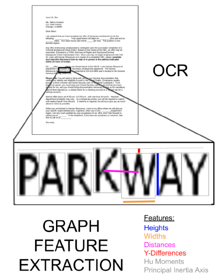

# Manipulation-Detection-in-Documents

This work aims to detect character-level forgeries in digital documents for information verification purposes (splice and copy-move forgeries). This is an implementation of the idea described in [1] with a few modifications and liberties taken.

- This approach works by extracting character bounding boxes using Tesseract OCR. The boxes are then used to construct graph features for each potentially manipulated character that are then fed into an XGB classifier.

- The model is trained on images synthesized from genuine PDF documents.

    To  construct the dataset, we first split a PDF document into individual images, then we use Tesseract to detect characters and randomly either resize them or shift their position by a few pixels.

    And to label the forged charcters, an additional ground truth image is saved in which fogeries are placed in colored boxes.

[1] Hailey James, Otkrist Gupta, and Dan Raviv. "OCR Graph Features for Manipulation Detection in Documents." arXiv preprint arXiv:2009.05158 (2020). https://arxiv.org/abs/2009.05158